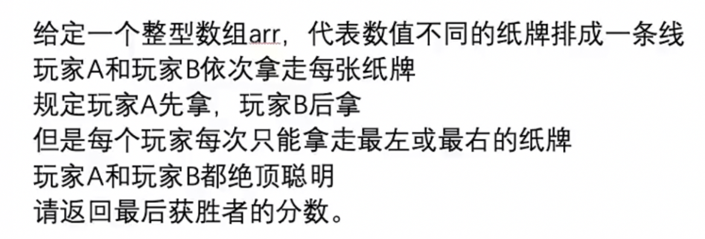

# 暴力递归&动态规划

## 暴力递归

### 暴力递归就是尝试

1.把问题转化为规模缩小了的同类问题的子问题

2.有明确的不需要继续进行递归的条件（base case）

3.有当得到了子问题的结果之后的决策过程

4.不记录每一个子问题的解

### 常见题目

#### 熟悉什么叫尝试

· 打印n层汉诺塔从最左边移动到最右边的全部过程

· 打印一个字符串的全部子序列

· 打印一个字符串的全部子序列，要求不要出现重复字面值的子序列

· 打印一个字符串的全排列

· 打印一个字符串的全排列，要求不要出现重复的排列

---

#### 机器人题目

纵坐标是cur，当前位置，范围是1-N

横坐标是rest，还剩几步可以走，范围是0-K

dp表是N*K大小，其实第一行根本没用到，cur不可能为0

举个例子：数组是[1，2，3，4，5]，机器人在2，要到4，能走6步

然后看递归的过程

当rest=0的时候，cur只有等于4的时候，值为1，这一列剩下的都是0

我们最终要求的是rest剩6步，cur是2的这一格的值，就是图里五角星的位置。

看递归过程：

①当cur=1时，也就是第1行（第0行用不到）

每一格都依赖当前格左下的一格的数

②当cur=5时，也就是第5行（第0行用不到）

每一格都依赖当前格左上的一格的数

③当cur=2，3，4时，也就是第2，3，4行（第0行用不到）

每一格都依赖当前格左上的一格的数 + 当前格左下的一格的数

我们此时按照这个规律把所有格子填满，会得到下图的效果

最后根据这个规律去写代码(整体是个会撞墙的杨辉三角)，看代码！！！Demo05

---

#### 抽牌问题

举个例子，数组是[7，4，16，15，1]，数组长度是5，假设N代表数组长度

两张缓存表

纵坐标都是L(范围0到N-1)

纵坐标都是R(范围0到N-1)

因为L不可能>R，所以两张表的左下半区域没用，画叉

我们要求啥？————从L=0到R=N-1的范围上，最好成绩，也就是整张表右上角那一格的数，图中画了五角星

①当L=R的时候，说明最后剩一张牌，也就是两张表的对角线

对于先手来说，对角线就是每张牌的值

对于后手来说，最后一张牌被先手拿走了，所以对角线都是0

②如果不是对角线的格子，我们来看递归过程

如果是先手表的格子，依赖了后手表相同位置格子的下方格子 + 后手表相同位置格子的左方格子

如果是后手表的格子，依赖了先手表相同位置格子的下方格子 + 后手表相同位置格子的左方格子

而我们恰恰已经知道两张表从左上到右下的对角线的每一格的值了，那其实可以根据对角线整体往右上方去推断，每一条对角线的每一格的值，如图所示

接下来就是看代码了！！！看Demo6
