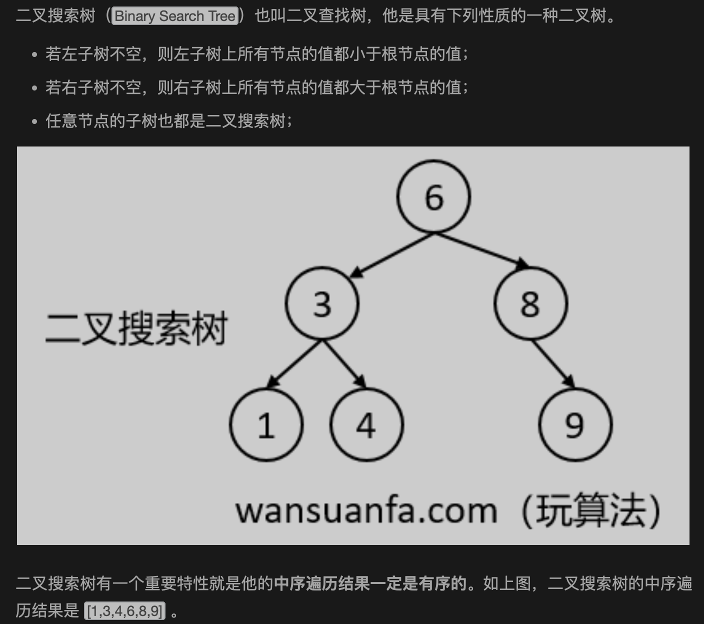

# 搜索二叉树

https://mp.weixin.qq.com/s?__biz=MzU0ODMyNDk0Mw==&mid=2247495540&idx=1&sn=214e962041b5c8e9a70bd4059371ad05&chksm=fb427c54cc35f542e1b3ef7c9fd6ed5b6267843e12e0d93d282c2bd2fdac59edc6bec83fd9a1&scene=27

## 1.定义

## 2.经典BST无重复值

## 3.怎么判断二叉树是否为搜索二叉树

对于节点X

①X的左子树是搜索二叉树

②X的右子树是搜索二叉树

③X的左子树最大值<X

④X的右子树最小值>X
